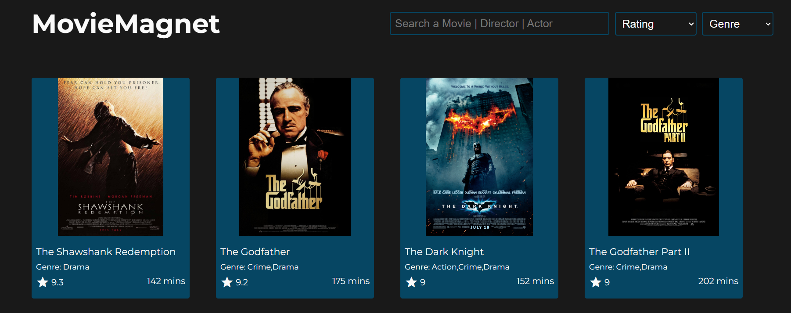

# MovieMagnet

## Overview

The "MovieMagnet" is a web application that allows users to explore a curated collection of movies. Users can search for movies by various criteria such as movie title, director name, genres, or categories.

## Features

- **Search Functionality**: Users can search for movies using keywords related to movie title, director name, genres, or categories.
- **Firebase Integration**: Movie data is fetched from a Firebase database, ensuring real-time updates and reliability.
- **Filtering by Genres**: Users can filter movies based on genres such as adventure, romance, action, etc.

## Technologies Used

- **Frontend**: HTML, CSS, JavaScript
- **Backend**: Firebase

## Usage

- Upon opening the website, users can browse the collection of movies.
- Use the search bar to search for movies based on title, director, or genres.